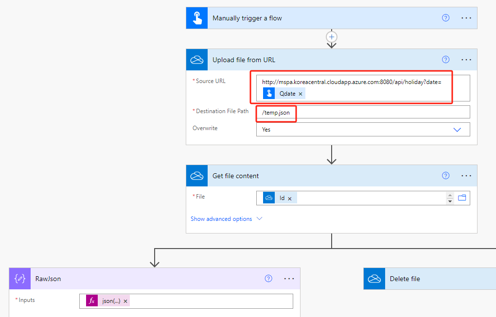

# iFreeFlow 项目

## 简介
由于 Power Automate 本身的功能限制，某些功能需要调用 HTTP 的 API 接口或第三方连接器才能实现。然而，许多企业禁用了第三方连接器，并且普通用户仅拥有标准许可证，只能使用默认连接器。考虑到中国的特殊情况，我们特意推出了 iFreeFlow 项目，旨在为广大的 Power Automate 用户提供便捷且实用的 API 服务。

iFreeFlow 项目已经开源，大家可以直接调用 OneDrive 的“URL 上传文件”功能来使用这些 API。同时，我们欢迎大家下载本项目的解决方案，并鼓励大家在自己的服务器上进行私有化部署。请勿对该项目进行商业付费，以免上当受骗。如果你觉得这个开源项目对你有很大帮助，请考虑通过 buy me a coffee 来赞助服务器的运维费用。谢谢！

## 特点
- **免费**: 完全免费使用。
- **开源**: 代码公开，可自由下载和修改。
- **私有化部署**: 支持在自己的服务器上部署。
- **多平台调用**: 云端 Flow 和桌面 PAD 均可调用。

## 功能亮点
- **节假日查询**: 返回日期是否为节假日等详细信息。
- **数据计算**: 计算一组数字的求和与平均数。
- **二维码生成**: 生成字符串对应的二维码并下载。
- **微信通知推送**: 通过 POST 请求发送微信通知。

## 接口文档
- **接口地址**:
  - `http://mspa.koreacentral.cloudapp.azure.com:8080/`
  - `http://20.41.84.42:8080/` (IP 地址可能不稳定)
  - `https://api.mspa.app/` (若连接失败请使用第一个)

## 使用示例

### 节假日查询
```plaintext
http://mspa.koreacentral.cloudapp.azure.com:8080/api/holiday?date=2023-10-01
```
返回日期信息，包含是否节假日、是否调休、周数和星期等。

### 数据计算
```plaintext
http://mspa.koreacentral.cloudapp.azure.com:8080/api/sum_and_average?numbers=1,2,3,4,5
```
返回求和和平均数的计算结果。

### 二维码生成
```plaintext
http://mspa.koreacentral.cloudapp.azure.com:8080/api/qrcode?text=HelloWorld
```
浏览器自动下载名为 HelloWorld.png 的二维码图像文件。

### 微信通知推送
```plaintext
http://mspa.koreacentral.cloudapp.azure.com:8080/api/wechat_notify?wechat_id=...&title=...&content=...
```
发送 POST 请求，返回响应 JSON。

## 参与方式
我们诚邀各位用户下载并使用 iFreeFlow 项目，并鼓励在自己的服务器上进行私有化部署。如果你觉得这个项目对你有帮助，请通过 [Buy Me A Coffee](#) 赞助服务器的运维费用。

## 赞助支持


## 贡献与反馈
我们欢迎任何形式的贡献和反馈。如果你有新功能需求或改进建议，欢迎提交 Issue 或 Pull Request。
