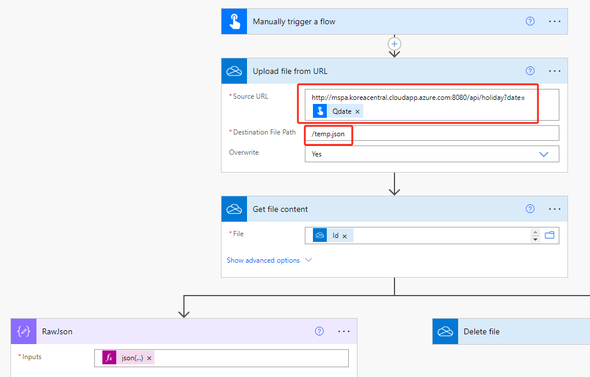

# iFreeFlow 项目 / iFreeFlow Project

[中文](#中文) | [English](#english)

---

## 中文

### 简介
由于 Power Automate 本身的功能限制，某些功能需要调用 HTTP 的 API 接口或第三方连接器才能实现。然而，许多企业禁用了第三方连接器，并且普通用户仅拥有标准许可证，只能使用默认连接器。考虑到中国的特殊情况，我们特意推出了 iFreeFlow 项目，旨在为广大的 Power Automate 用户提供便捷且实用的 API 服务。

iFreeFlow 项目已经开源，大家可以直接调用 OneDrive 的"URL 上传文件"功能来使用这些 API。同时，我们欢迎大家下载本项目的解决方案，并鼓励大家在自己的服务器上进行私有化部署。请勿对该项目进行商业付费，以免上当受骗。如果你觉得这个开源项目对你有很大帮助，请考虑通过 buy me a coffee 来赞助服务器的运维费用。谢谢！

### 特点
- **免费**: 完全免费使用
- **开源**: 代码公开，可自由下载和修改
- **私有化部署**: 支持在自己的服务器上部署
- **多平台调用**: 云端 Flow 和桌面 PAD 均可调用
- **多版本支持**: 提供多个 API 版本以满足不同需求

### 功能列表

#### 1. 节假日查询 (Holiday Query)
返回指定日期的详细信息，包括是否为节假日、是否调休、周数和星期等。

**端点**: `/api/holiday`
**方法**: GET
**参数**:
- `date`: 日期格式 YYYY-MM-DD (例如: 2023-10-01)

**示例**:
```plaintext
http://ifreeflow.koreacentral.cloudapp.azure.com:8080/api/holiday?date=2023-10-01
```

**返回**:
```json
{
  "date": "2023-10-01",
  "week_number": 39,
  "weekday": "Sunday",
  "is_holiday": true,
  "is_workday": false,
  "holiday_name": "国庆节",
  "is_in_lieu": false
}
```

#### 2. 数据计算 (Data Calculation)
计算一组数字的求和与平均数。

**端点**: `/api/sum_and_average`
**方法**: GET
**参数**:
- `numbers`: 用逗号分隔的数字列表 (例如: 1,2,3,4,5)

**示例**:
```plaintext
http://ifreeflow.koreacentral.cloudapp.azure.com:8080/api/sum_and_average?numbers=1,2,3,4,5
```

**返回**:
```json
{
  "numbers": [1, 2, 3, 4, 5],
  "sum": 15,
  "average": 3.0
}
```

#### 3. 二维码生成 (QR Code Generation)
生成字符串对应的二维码并下载。

**端点**: `/api/qrcode`
**方法**: GET
**参数**:
- `text`: 要编码的文本内容

**示例**:
```plaintext
http://ifreeflow.koreacentral.cloudapp.azure.com:8080/api/qrcode?text=HelloWorld
```

**返回**: 浏览器自动下载名为 HelloWorld.png 的二维码图像文件

#### 4. 微信通知推送 (WeChat Notification)
通过 POST 请求发送微信通知。

**端点**: `/api/wechat_notify`
**方法**: GET
**参数**:
- `wechat_id`: 微信推送 ID
- `title`: 通知标题
- `content`: 通知内容

**示例**:
```plaintext
http://ifreeflow.koreacentral.cloudapp.azure.com:8080/api/wechat_notify?wechat_id=YOUR_ID&title=测试&content=这是一条测试消息
```

#### 5. 金额大写转换 (Amount to Chinese Upper Case)
将数字金额转换为中文大写金额（适用于财务报销等场景）。

**端点**: `/api/convert_amount`
**方法**: GET
**参数**:
- `amount`: 金额数字 (例如: 12345.67)

**示例**:
```plaintext
http://ifreeflow.koreacentral.cloudapp.azure.com:8080/api/convert_amount?amount=12345.67
```

**返回**:
```json
{
  "amount": "12345.67",
  "chinese_upper": "壹万贰仟叁佰肆拾伍元陆角柒分"
}
```

#### 6. 文本翻译 (Text Translation)
支持中英文互译。

**端点**: `/api/translate`
**方法**: GET
**参数**:
- `text`: 要翻译的文本
- `target_lang`: 目标语言，支持 'en' (英文) 或 'zh' (中文)，默认为 'en'

**示例**:
```plaintext
http://ifreeflow.koreacentral.cloudapp.azure.com:8080/api/translate?text=你好世界&target_lang=en
```

**返回**:
```json
{
  "original": "你好世界",
  "translation": "Hello World"
}
```

#### 7. Word 转 PDF (Word to PDF Conversion)
将 Word 文档转换为 PDF 格式（v3.py 和 v31.py 版本支持）。

**端点**: `/convert`
**方法**: GET
**参数**:
- `filename`: Word 文件名 (.doc 或 .docx)

**示例**:
```plaintext
http://ifreeflow.koreacentral.cloudapp.azure.com:8080/convert?filename=document.docx
```

**返回**:
```json
{
  "conversion_time": 2.5,
  "pdf_file_path": "/path/to/document.pdf"
}
```

#### 8. 文件夹压缩 (Folder Compression)
将指定文件夹压缩为 ZIP 文件（v31.py 版本支持）。

**端点**: `/zip-folder`
**方法**: GET
**参数**:
- `foldername`: 要压缩的文件夹名称

**示例**:
```plaintext
http://ifreeflow.koreacentral.cloudapp.azure.com:8080/zip-folder?foldername=myFolder
```

**返回**:
```json
{
  "zip_file_path": "/path/to/myFolder.zip"
}
```

#### 9. 发票 OCR 识别 (Invoice OCR Recognition)
识别发票图像并提取信息（v31.py 版本支持）。

**端点**: `/invoice-ocr`
**方法**: GET
**参数**:
- `filename`: 发票图像文件名

**示例**:
```plaintext
http://ifreeflow.koreacentral.cloudapp.azure.com:8080/invoice-ocr?filename=invoice.jpg
```

### 接口地址
- `http://ifreeflow.koreacentral.cloudapp.azure.com:8080/`
- `http://20.39.200.13:8080/` (IP 地址可能不稳定)
- `https://api.mspa.app/` (若连接失败请使用第一个)

### 使用示例


### 未来功能增强建议

以下是我们考虑添加的潜在功能，欢迎社区贡献：

1. **图片处理**
   - 图片压缩和格式转换
   - 图片水印添加
   - 图片尺寸调整

2. **文档处理**
   - PDF 合并与拆分
   - Excel 数据分析
   - 文档格式批量转换

3. **数据处理**
   - JSON/XML 格式转换
   - 数据加密解密
   - Base64 编码解码

4. **通知服务**
   - 邮件发送服务
   - 短信通知服务
   - 钉钉、企业微信通知

5. **AI 功能**
   - 文本摘要生成
   - 情感分析
   - 关键词提取

6. **工具类**
   - IP 地址查询
   - 天气查询
   - 汇率转换

### 部署方式

#### 环境要求
- Python 3.7+
- Flask
- 其他依赖见 requirements.txt

#### 安装步骤
```bash
# 克隆项目
git clone https://github.com/jixiexiaoge/iFreeFlow.git
cd iFreeFlow

# 安装依赖
pip install -r requirements.txt

# 运行服务（选择版本）
python apiv2.5.py  # 或 python v3.py 或 python v31.py
```

### 参与方式
我们诚邀各位用户下载并使用 iFreeFlow 项目，并鼓励在自己的服务器上进行私有化部署。如果你觉得这个项目对你有帮助，请通过下方二维码赞助服务器的运维费用。

### 赞助支持


### 贡献与反馈
我们欢迎任何形式的贡献和反馈。如果你有新功能需求或改进建议，欢迎提交 Issue 或 Pull Request。

### 许可证
本项目采用开源许可证，详见 [LICENSE](LICENSE) 文件。

---

## English

### Introduction
Due to the functional limitations of Power Automate itself, some features require calling HTTP API interfaces or third-party connectors. However, many enterprises disable third-party connectors, and regular users with standard licenses can only use default connectors. Considering China's special circumstances, we have launched the iFreeFlow project to provide convenient and practical API services for Power Automate users.

The iFreeFlow project is open-source. You can directly use these APIs by calling OneDrive's "Upload File via URL" function. We welcome everyone to download the project's solution and encourage private deployment on your own servers. Please do not commercialize this project to avoid fraud. If you find this open-source project helpful, please consider sponsoring server operating costs through "buy me a coffee". Thank you!

### Features
- **Free**: Completely free to use
- **Open Source**: Code is public, freely downloadable and modifiable
- **Private Deployment**: Support deployment on your own server
- **Multi-Platform**: Callable from both Cloud Flow and Desktop PAD
- **Multiple Versions**: Multiple API versions available for different needs

### API List

#### 1. Holiday Query
Returns detailed information about a specified date, including whether it's a holiday, compensatory leave, week number, and weekday.

**Endpoint**: `/api/holiday`
**Method**: GET
**Parameters**:
- `date`: Date format YYYY-MM-DD (e.g., 2023-10-01)

**Example**:
```plaintext
http://ifreeflow.koreacentral.cloudapp.azure.com:8080/api/holiday?date=2023-10-01
```

**Response**:
```json
{
  "date": "2023-10-01",
  "week_number": 39,
  "weekday": "Sunday",
  "is_holiday": true,
  "is_workday": false,
  "holiday_name": "National Day",
  "is_in_lieu": false
}
```

#### 2. Data Calculation
Calculate sum and average of a set of numbers.

**Endpoint**: `/api/sum_and_average`
**Method**: GET
**Parameters**:
- `numbers`: Comma-separated list of numbers (e.g., 1,2,3,4,5)

**Example**:
```plaintext
http://ifreeflow.koreacentral.cloudapp.azure.com:8080/api/sum_and_average?numbers=1,2,3,4,5
```

**Response**:
```json
{
  "numbers": [1, 2, 3, 4, 5],
  "sum": 15,
  "average": 3.0
}
```

#### 3. QR Code Generation
Generate and download a QR code for a given string.

**Endpoint**: `/api/qrcode`
**Method**: GET
**Parameters**:
- `text`: Text content to encode

**Example**:
```plaintext
http://ifreeflow.koreacentral.cloudapp.azure.com:8080/api/qrcode?text=HelloWorld
```

**Response**: Browser automatically downloads a QR code image file named HelloWorld.png

#### 4. WeChat Notification
Send WeChat notifications via POST request.

**Endpoint**: `/api/wechat_notify`
**Method**: GET
**Parameters**:
- `wechat_id`: WeChat push ID
- `title`: Notification title
- `content`: Notification content

**Example**:
```plaintext
http://ifreeflow.koreacentral.cloudapp.azure.com:8080/api/wechat_notify?wechat_id=YOUR_ID&title=Test&content=This is a test message
```

#### 5. Amount to Chinese Upper Case
Convert numeric amounts to Chinese uppercase format (suitable for financial reimbursement scenarios).

**Endpoint**: `/api/convert_amount`
**Method**: GET
**Parameters**:
- `amount`: Numeric amount (e.g., 12345.67)

**Example**:
```plaintext
http://ifreeflow.koreacentral.cloudapp.azure.com:8080/api/convert_amount?amount=12345.67
```

**Response**:
```json
{
  "amount": "12345.67",
  "chinese_upper": "壹万贰仟叁佰肆拾伍元陆角柒分"
}
```

#### 6. Text Translation
Support Chinese-English bidirectional translation.

**Endpoint**: `/api/translate`
**Method**: GET
**Parameters**:
- `text`: Text to translate
- `target_lang`: Target language, supports 'en' (English) or 'zh' (Chinese), defaults to 'en'

**Example**:
```plaintext
http://ifreeflow.koreacentral.cloudapp.azure.com:8080/api/translate?text=Hello World&target_lang=zh
```

**Response**:
```json
{
  "original": "Hello World",
  "translation": "你好世界"
}
```

#### 7. Word to PDF Conversion
Convert Word documents to PDF format (supported in v3.py and v31.py versions).

**Endpoint**: `/convert`
**Method**: GET
**Parameters**:
- `filename`: Word file name (.doc or .docx)

**Example**:
```plaintext
http://ifreeflow.koreacentral.cloudapp.azure.com:8080/convert?filename=document.docx
```

**Response**:
```json
{
  "conversion_time": 2.5,
  "pdf_file_path": "/path/to/document.pdf"
}
```

#### 8. Folder Compression
Compress a specified folder into a ZIP file (supported in v31.py version).

**Endpoint**: `/zip-folder`
**Method**: GET
**Parameters**:
- `foldername`: Name of the folder to compress

**Example**:
```plaintext
http://ifreeflow.koreacentral.cloudapp.azure.com:8080/zip-folder?foldername=myFolder
```

**Response**:
```json
{
  "zip_file_path": "/path/to/myFolder.zip"
}
```

#### 9. Invoice OCR Recognition
Recognize invoice images and extract information (supported in v31.py version).

**Endpoint**: `/invoice-ocr`
**Method**: GET
**Parameters**:
- `filename`: Invoice image file name

**Example**:
```plaintext
http://ifreeflow.koreacentral.cloudapp.azure.com:8080/invoice-ocr?filename=invoice.jpg
```

### API Base URLs
- `http://ifreeflow.koreacentral.cloudapp.azure.com:8080/`
- `http://20.39.200.13:8080/` (IP address may be unstable)
- `https://api.mspa.app/` (Use the first one if connection fails)

### Usage Example


### Future Enhancement Suggestions

Here are potential features we're considering adding. Community contributions are welcome:

1. **Image Processing**
   - Image compression and format conversion
   - Watermark addition
   - Image resizing

2. **Document Processing**
   - PDF merge and split
   - Excel data analysis
   - Batch document format conversion

3. **Data Processing**
   - JSON/XML format conversion
   - Data encryption/decryption
   - Base64 encoding/decoding

4. **Notification Services**
   - Email sending service
   - SMS notification service
   - DingTalk, WeChat Work notifications

5. **AI Features**
   - Text summarization
   - Sentiment analysis
   - Keyword extraction

6. **Utility Tools**
   - IP address lookup
   - Weather query
   - Currency conversion

### Deployment

#### Requirements
- Python 3.7+
- Flask
- Other dependencies see requirements.txt

#### Installation Steps
```bash
# Clone the project
git clone https://github.com/jixiexiaoge/iFreeFlow.git
cd iFreeFlow

# Install dependencies
pip install -r requirements.txt

# Run the service (choose a version)
python apiv2.5.py  # or python v3.py or python v31.py
```

### How to Participate
We sincerely invite all users to download and use the iFreeFlow project, and encourage private deployment on your own servers. If you find this project helpful, please sponsor server operating costs through the QR code below.

### Sponsorship


### Contribution and Feedback
We welcome any form of contribution and feedback. If you have new feature requests or improvement suggestions, please submit an Issue or Pull Request.

### License
This project is licensed under an open-source license. See [LICENSE](LICENSE) file for details.
